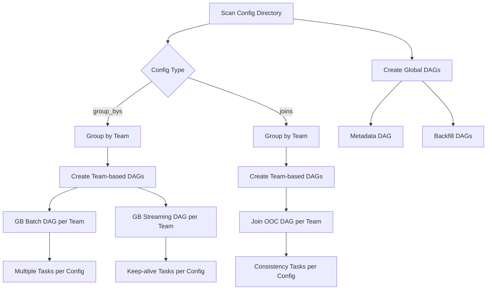
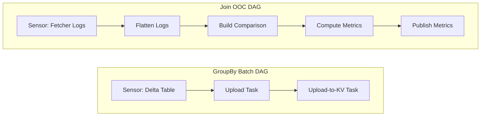

# Chronon Task Orchestration and Scheduling Design

## Table of Contents
1. [Background](#background)
2. [Overview](#overview)
3. [Architecture](#architecture)
4. [Airflow Implementation](#airflow-implementation)
5. [GCP-Specific Components](#gcp-specific-components)
6. [Execution Workflow](#execution-workflow)
7. [Monitoring and Alerting](#monitoring-and-alerting)
8. [Future Enhancements](#future-enhancements)

## Background
Chronon is a platform that abstracts away the complexity of data computation and serving for AI/ML applications. Users define features as transformation of raw data, then Chronon can perform batch and streaming computation, scalable backfills, low-latency serving, guaranteed correctness and consistency, as well as a host of observability and monitoring tools.

It allows you to utilize all of the data within your organization, from batch tables, event streams or services to power your AI/ML projects, without needing to worry about all the complex orchestration that this would usually entail.

But currently we still need to submit and manage various chronon jobs manually. This document outlines a design for automating the orchestration of Chronon jobs using Apache Airflow.
### Current State
Currently there are many Chronon jobs to making chronon features work, these jobs are executed manually with `zipline cli`:
- Backfills historical group by data
    ```
    zipline run \
      --mode backfill \
      --conf compiled/group_bys/default/merchant_features.v1 \
      --start-ds $START_DATE \
      --end-ds $END_DATE \
      --artifact-prefix $ARTIFACT_PREFIX \
      --version $ZIPLINE_VERSION \
      --enable-debug
    ```
- Backfills historical join data
    ```
    zipline run \
      --mode backfill \
      --conf compiled/joins/default/pafraud_join.v1 \
      --start-ds $START_DATE \
      --end-ds $END_DATE \
      --artifact-prefix $ARTIFACT_PREFIX \
      --version $ZIPLINE_VERSION \
      --enable-debug
    ```
- Generate group by upload dataset
    ```
    zipline run \
      --mode upload \
      --conf compiled/group_bys/default/merchant_features.v1 \
      --ds $END_DATE \
      --artifact-prefix $ARTIFACT_PREFIX \
      --version $ZIPLINE_VERSION \
      --enable-debug
    ```
- Uploads group by dataset to kv store
    ```
    zipline run \
      --mode upload-to-kv \
      --conf compiled/group_bys/default/merchant_features.v1 \
      --ds $END_DATE \
      --uploader spark \
      --artifact-prefix $ARTIFACT_PREFIX \
      --version $ZIPLINE_VERSION \
      --additional-jars "gs://spark-lib/bigtable/spark-bigtable_2.12-0.1.0.jar" \
      --enable-debug
    ```
- upload group by / join metadata
    ```
    zipline run \
      --mode metadata-upload \
      --conf compiled/group_bys/default/merchant_features.v1 \
      --artifact-prefix $ARTIFACT_PREFIX \
      --version $ZIPLINE_VERSION \
      --enable-debug
    
    zipline run \
      --mode metadata-upload \
      --conf compiled/joins/default/pafraud_join.v1 \
      --artifact-prefix $ARTIFACT_PREFIX \
      --version $ZIPLINE_VERSION \
      --enable-debug
    ```
- Online streaming group by calculation job
    ```
    zipline run \
      --mode streaming \
      --streaming-mode deploy \
      --conf compiled/group_bys/default/merchant_features.v1 \
      --kafka-bootstrap $KAFKA_BOOTSTRAP_SERVERS \
      --flink-state-uri $FLINK_STATE_URI \
      --artifact-prefix $ARTIFACT_PREFIX \
      --version $ZIPLINE_VERSION \
      --parallelism $FLINK_PARALLELISM \
      --no-savepoint \
      --enable-debug
    ```
- Online Offline consistency validation
    ```
    # pre-step: config ooc kafka topic in fetcher service to log all request/response events to kafka topic
    
    # step 1: dump fetcher events from kafka topic to warehouse delta table as raw logs
    
    # step 2: flatten fetcher raw logs
    zipline run \
      --mode log-flattener \
      --conf compiled/joins/default/pafraud_join.v1 \
      --log-table chronon_fetcher_raw_logs \
      --schema-table chronon_fetcher_schemas \
      --ds 2025-09-30 \
      --artifact-prefix $ARTIFACT_PREFIX \
      --version $ZIPLINE_VERSION \
      --enable-debug
    
    # step 3: build comparison table (optional internal step)
    zipline run \
      --mode build-comparison-table \
      --conf compiled/joins/default/pafraud_join.v1 \
      --ds 2025-09-30 \
      --artifact-prefix $ARTIFACT_PREFIX \
      --version $ZIPLINE_VERSION \
      --enable-debug
      
    # step 4: compute consistency metrics
    zipline run \
      --mode consistency-metrics-compute \
      --conf compiled/joins/default/pafraud_join.v1 \
      --ds 2025-09-30 \
      --artifact-prefix $ARTIFACT_PREFIX \
      --version $ZIPLINE_VERSION \
      --enable-debug
    ```

### Challenges with Manual Execution
1. **No Automation**: Operators must manually trigger each job in sequence
2. **Dependency Management**: No automatic handling of job dependencies
3. **Error Handling**: Manual intervention required for failures
4. **Monitoring**: Limited visibility into job status and history
5. **Scheduling**: No support for regular batch processing
6. **Scalability**: Difficult to manage multiple feature pipelines

### Why Task Orchestration?
Task orchestration provides:
- **Automated Scheduling**: Regular execution of batch jobs (daily, hourly, etc.)
- **Dependency Resolution**: Automatic triggering based on upstream data availability
- **Error Recovery**: Automatic retries and failure handling
- **Monitoring**: Centralized view of all pipeline executions
- **Scalability**: Easy management of hundreds of feature pipelines

## Overview

### Goals
1. Automate Chronon feature generation pipelines using Apache Airflow
2. Implement dynamic DAG generation from Chronon configurations
3. Handle complex dependencies between different job types
4. Provide GCP-native integration for Delta Lake, GCS, Dataproc, and Bigtable
5. Enable monitoring, alerting, and observability

### Airflow Dynamic DAG generation


### Task Types and Dependencies


## Architecture

### High-Level Architecture


**Component Description**  

1. **Chronon Repo**: Chronon feature definitions and team configurations
2. **Orchestration Layer**: Airflow components for scheduling and dependency management
3. **Execution Layer**: Spark/Flink jobs running on Dataproc clusters
4. **Storage Layer**:
   - **Delta Lake on GCS**: Primary data warehouse for feature storage
   - **Bigtable**: Key-value store for low-latency online feature serving
   - **GCS**: Object storage for artifacts and intermediate data

## Airflow Implementation

### DAG Types Overview

All DAGs in the Chronon orchestration system follow either a **team-based** or **single global** pattern. There are no config-based DAGs - even Join configs are organized by team:

1. **GroupBy DAGs** (`group_by_dag_constructor.py`):
   - `chronon_gb_backfill`: Single global DAG for manual backfill operations (no schedule)
   - `chronon_gb_batch_{team}`: Team-based DAGs for daily batch processing and KV uploads
   - `chronon_gb_streaming_{team}`: Team-based DAGs for streaming job keep-alive (every 10 minutes)

2. **Join DAGs** (`join_dag_constructor.py`):
   - `chronon_join_backfill`: Single global DAG for manual backfill operations (no schedule)
   - `chronon_join_ooc_{team}`: Team-based DAGs for Online/Offline Consistency checks (daily)

3. **Metadata DAG** (`join_dag_constructor.py`):
   - `chronon_metadata`: Single global DAG that uploads GroupBy and Join configs to KV store (every 10 minutes)
   - Uses hash-based change detection to avoid unnecessary uploads
   - Stores config directory hash in XCom for comparison between runs

### Directory Structure
```
airflow/
├── dags/
│   └── chronon_dags.py                         # Dynamic DAG generation entrypoint
├── data/
│   └── chronon_configs/
│       ├── teams.py                            # Team configurations
│       ├── group_bys/                          # GroupBy configs
│       ├── joins/                              # Join configs
│       └── compiled/                           # Compiled configs
└── plugins/
    └── chronon_utils/
        ├── group_by_dag_constructor.py         # GroupBy batch & streaming DAGs
        ├── join_dag_constructor.py             # Join backfill & frontfill DAGs
        ├── helpers.py                          # Helper functions and utilities
        ├── operators.py                        # Custom Chronon operators
        └── constants.py                        # Configuration constants
```

### Dynamic DAG Generation

#### 1. Configuration Discovery Flow


The DAG generation follows a consistent team-based approach:
- **All configs are organized by team** - no individual config-based DAGs
- **Team-based DAGs** contain multiple tasks, one for each config belonging to that team
- **Global DAGs** (backfill and metadata) operate across all teams

#### 2. DAG Types and Scheduling

| DAG Type | Schedule | Trigger | Description |
|----------|----------|---------|-------------|
| `chronon_gb_backfill` | None | Manual | Backfill historical GroupBy data with user-specified date range |
| `chronon_gb_batch_{team}` | @daily | Automatic | Daily upload and KV store updates |
| `chronon_gb_streaming_{team}` | */10 * * * * | Automatic | Keep-alive checks every 10 minutes |
| `chronon_join_backfill` | None | Manual | Backfill historical Join data with user-specified date range |
| `chronon_join_ooc_{team}` | @daily | Automatic | Daily consistency checks |
| `chronon_metadata` | */10 * * * * | Automatic | Metadata uploads every 10 minutes |

#### 3. Task Dependency Management



### Dependency Resolution

#### 1. Dependency Extractor
```python
# dependency_resolver.py
class DependencyResolver:
    def __init__(self, config: Dict):
        self.config = config

    def extract_dependencies(self) -> List[Dependency]:
        """Extract all dependencies from a configuration"""
        dependencies = []

        # For GroupBy configs
        if 'sources' in self.config:
            for source in self.config['sources']:
                if 'entities' in source:
                    dep = self._extract_entity_dependency(source['entities'])
                    dependencies.append(dep)
                elif 'events' in source:
                    dep = self._extract_event_dependency(source['events'])
                    dependencies.append(dep)

        # For Join configs
        if 'left' in self.config:
            dep = self._extract_table_dependency(self.config['left'])
            dependencies.append(dep)

        if 'joinParts' in self.config:
            for join_part in self.config['joinParts']:
                if 'groupBy' in join_part:
                    dep = Dependency(
                        type='group_by',
                        name=join_part['groupBy']['metaData']['name'],
                        mode='upload'
                    )
                    dependencies.append(dep)

        return dependencies

    def _extract_table_dependency(self, source: Dict) -> Dependency:
        """Extract Delta table dependency"""
        return Dependency(
            type='delta_table',
            path=f"gs://{GCS_BUCKET}/delta/{source['namespace']}/{source['table']}",
            partition_column=source.get('partitionColumn', 'ds')
        )
```

#### 2. Sensor Creation
```python
# gcp_sensors.py
from airflow.providers.google.cloud.sensors.gcs import GCSObjectExistenceSensor
from airflow.sensors.external_task_sensor import ExternalTaskSensor

def create_dependency_sensors(dependencies: List[Dependency], dag: DAG) -> List:
    """Create sensors for all dependencies"""
    sensors = []

    for dep in dependencies:
        if dep.type == 'delta_table':
            # Check for Delta table partition
            partition_path = f"{dep.path}/{dep.partition_column}={{{{ ds }}}}/"
            sensor = GCSObjectExistenceSensor(
                task_id=f"wait_for_delta_{dep.table}",
                bucket=GCS_BUCKET,
                object=partition_path,
                dag=dag,
                poke_interval=300,  # 5 minutes
                timeout=3600,  # 1 hour
                mode='reschedule'
            )
            sensors.append(sensor)

        elif dep.type == 'group_by':
            sensor = ExternalTaskSensor(
                task_id=f"wait_for_{dep.name}_{dep.mode}",
                external_dag_id=f"chronon_gb_{dep.mode}_{dep.name}",
                external_task_id="upload_features",
                dag=dag,
                mode='reschedule'
            )
            sensors.append(sensor)

    return sensors
```

### Execution Flow

#### 1. Chronon Operator Architecture

The `ChrononGCPOperator` extends BashOperator with GCP-specific functionality, construct the final zipline cli cmd and arguments according to specific tasks.

#### 2. Operator Implementation Details

**ChrononGCPOperator** key methods:
- `__init__()`: Initialize with mode, config path, and execution parameters
- `execute()`: Main execution logic with Dataproc or local mode
- `_execute_on_dataproc()`: Manages cluster lifecycle and job submission
- `_build_zipline_args()`: Constructs command-line arguments for Zipline
- `_get_cluster_config()`: Returns optimized cluster configuration per job type

**StreamingKeepAliveOperator** for Flink jobs:
- Checks if streaming job is running
- Restarts failed jobs automatically
- Manages Flink job lifecycle on Dataproc

**MetadataUploadOperator** for config synchronization:
- Calculates MD5 hash of entire config directory recursively
- Compares with previous hash stored in XCom
- Only uploads changes when hash differs
- Filters configs based on type (GroupBy: online only, Join: all)
- Stores new hash for next comparison

#### 3. Metadata DAG Implementation

The metadata DAG uses hash-based change detection to efficiently sync configurations:

```python
# MetadataUploadOperator key implementation
class MetadataUploadOperator(BaseOperator):
    def _calculate_config_hash(self, config_dir: str) -> str:
        """Calculate recursive MD5 hash of all JSON configs"""
        hash_md5 = hashlib.md5()
        config_data = {}

        for root, dirs, files in os.walk(config_dir):
            for file in sorted(files):
                if file.endswith('.json'):
                    file_path = os.path.join(root, file)
                    with open(file_path, 'rb') as f:
                        file_hash = hashlib.md5(f.read()).hexdigest()
                        config_data[relative_path] = file_hash

        # Create deterministic hash string
        hash_string = json.dumps(config_data, sort_keys=True)
        hash_md5.update(hash_string.encode('utf-8'))
        return hash_md5.hexdigest()

    def execute(self, context):
        # Get current and previous hash
        current_hash = self._calculate_config_hash(config_dir)
        previous_hash = context['task_instance'].xcom_pull(
            task_ids=self.task_id,
            key='config_hash',
            include_prior_dates=True
        )

        if previous_hash == current_hash:
            self.log.info("No changes detected, skipping upload")
            return {"status": "skipped", "hash": current_hash}

        # Upload changed configs to Bigtable
        # Store new hash for next run
        context['task_instance'].xcom_push(key='config_hash', value=current_hash)
```

This approach ensures:
- Minimal KV store writes (only when configs change)
- Fast change detection (MD5 hash comparison)
- Persistent state across DAG runs (XCom storage)
- Atomic updates (all-or-nothing upload)

#### 4. Complete DAG Examples
```python
# group_by_dag_constructor.py
def create_team_batch_dag(team: str, configs: List[Dict]) -> DAG:
    """Create a team-based batch DAG with all GroupBy configs"""

    dag = DAG(
        f"chronon_batch_dag_{team}",
        default_args=task_default_args(team_config, team),
        start_date=datetime(2024, 1, 1),
        schedule_interval='@daily',
        catchup=False,
        max_active_runs=1,
        concurrency=GROUP_BY_BATCH_CONCURRENCY,
        tags=['chronon', 'batch', team]
    )

    with dag:
        # Create tasks for each GroupBy config
        for config in configs:
            config_name = config['metaData']['name']

            # Extract dependencies
            deps = DependencyResolver(config).extract_dependencies()
            sensors = create_dependency_sensors(deps, dag)

            # Backfill task (if needed)
            if config.get('backfillStartDate'):
                backfill_task = ChrononGCPOperator(
                    task_id=f"backfill_{config_name}",
                    conf_path=config['config_path'],
                    mode="backfill",
                    repo=CHRONON_PATH,
                    conf_type="group_bys",
                    extra_args={
                        "start-ds": "{{ ds }}",
                        "end-ds": "{{ ds }}"
                    }
                )

                # Chain dependencies
                if sensors:
                    sensors >> backfill_task

            # Upload task (for online features)
            if config['metaData'].get('online'):
                upload_task = ChrononGCPOperator(
                    task_id=f"upload_{config_name}",
                    conf_path=config['config_path'],
                    mode="upload",
                    repo=CHRONON_PATH,
                    conf_type="group_bys",
                    extra_args={
                        "ds": "{{ ds }}"
                    }
                )

                # Bigtable upload task
                bigtable_upload_task = get_kv_store_upload_operator(
                    dag=dag,
                    conf=config,
                    team_conf=team_config
                )

                # Chain tasks
                if 'backfill_task' in locals():
                    backfill_task >> upload_task
                elif sensors:
                    sensors >> upload_task

                upload_task >> bigtable_upload_task

    return dag

# Create streaming DAG for team
def create_team_streaming_dag(team: str, configs: List[Dict]) -> DAG:
    """Create a team-based streaming DAG for real-time features"""

    dag = DAG(
        f"chronon_streaming_dag_{team}",
        default_args=task_default_args(team_config, team),
        start_date=datetime(2024, 1, 1),
        schedule_interval=timedelta(minutes=15),
        catchup=False,
        max_active_runs=1,
        tags=['chronon', 'streaming', team]
    )

    with dag:
        for config in configs:
            # Only create streaming tasks for real-time features
            if (config['metaData'].get('online') and
                config['metaData'].get('accuracy') == 'TEMPORAL'):

                config_name = config['metaData']['name']

                # Streaming keep-alive task
                streaming_task = StreamingKeepAliveOperator(
                    task_id=f"streaming_{config_name}",
                    conf_path=config['config_path']
                )

    return dag
```

#### 4. Online/Offline Consistency DAG
```python
# online_offline_consistency_dag_constructor.py
def create_consistency_dag(join_config: Dict) -> DAG:
    """Create DAG for online/offline consistency checks"""

    join_name = join_config['metaData']['name']
    team = join_config['metaData']['team']

    dag = DAG(
        f"chronon_online_offline_comparison_{join_name}",
        default_args=task_default_args(team_config, team),
        start_date=datetime(2024, 1, 1),
        schedule_interval='@daily',
        catchup=False,
        tags=['chronon', 'consistency', team]
    )

    with dag:
        # Build comparison table
        build_comparison = ChrononGCPOperator(
            task_id="build_comparison_table",
            conf_path=join_config['config_path'],
            mode="consistency-metrics-build",
            repo=CHRONON_PATH,
            conf_type="joins",
            extra_args={
                "ds": "{{ ds }}",
                "lookback-days": "7"
            }
        )

        # Compute metrics
        compute_metrics = ChrononGCPOperator(
            task_id="compute_consistency_metrics",
            conf_path=join_config['config_path'],
            mode="consistency-metrics-compute",
            repo=CHRONON_PATH,
            conf_type="joins",
            extra_args={
                "ds": "{{ ds }}"
            }
        )

        # Publish to monitoring
        publish_metrics = ChronoMetricsOperator(
            task_id="publish_metrics",
            job_type="consistency",
            config_name=join_name
        )

        # Chain tasks
        build_comparison >> compute_metrics >> publish_metrics

    return dag
```

## Implementation Requirements

### Configuration Setup

To deploy the Airflow orchestration, the following configurations must be set:

1. **Constants Configuration** (`constants.py`):
```python
# Required configurations
CHRONON_PATH = "/path/to/chronon/configs"  # Root of Chronon config repo with 'production' subdirectory
TEST_TEAM_NAME = "chronon_test"  # Team name for staging JAR testing
GROUP_BY_BATCH_CONCURRENCY = 300  # Concurrency limit for GroupBy DAGs
JOIN_CONCURRENCY = 100  # Concurrency limit for Join DAGs
time_parts = ["ds", "ts", "hr"]  # Time-based partition column names

# GCP-specific configurations
GCP_PROJECT = "your-gcp-project"
GCP_REGION = "us-central1"
GCS_BUCKET = "your-chronon-bucket"
DELTA_LAKE_PREFIX = "gs://your-chronon-bucket/delta"
ARTIFACT_PREFIX = "gs://your-chronon-bucket/artifacts"
ZIPLINE_VERSION = "1.0.0"
BIGTABLE_INSTANCE = "chronon-features"  # Default Bigtable instance
```

2. **KV Store Upload Implementation** (`helpers.py`):
```python
def get_kv_store_upload_operator(dag, conf, team_conf):
    """
    Implementation for uploading features to Bigtable.
    Required only for online serving features.
    """
    # Only Bigtable is supported as KV store
    return BigtableUploadOperator(
        task_id=f"upload_to_bigtable_{conf['metaData']['name']}",
        table_name=f"chronon_{conf['metaData']['name']}",
        instance_id=team_conf.get('bigtable_instance'),
        dag=dag
    )
```

3. **Team Configuration** (`teams.json`):
```json
{
  "default": {
    "team_name": "default",
    "airflow_queue": "default",
    "dag_start_date": "2024-01-01",
    "maintainer_emails": ["team@example.com"],
    "user": "chronon",
    "bigtable_instance": "chronon-features",
    "dataproc_staging_bucket": "gs://chronon-staging"
  },
  "ml_team": {
    "team_name": "ml_team",
    "maintainer_emails": ["ml-team@example.com"],
    "bigtable_instance": "ml-features"
  }
}
```

## GCP-Specific Components

### 1. Delta Lake Integration
```python
class DeltaTablePartitionSensor(BaseSensorOperator):
    """Sensor for checking Delta table partition existence on GCS"""

    def __init__(self, table_path: str, partition_id: str, **kwargs):
        super().__init__(**kwargs)
        self.table_path = table_path
        self.partition_id = partition_id

    def poke(self, context):
        # Check if Delta table partition exists
        from google.cloud import storage
        client = storage.Client(project=GCP_PROJECT)
        bucket_name = self.table_path.split('/')[2]
        prefix = '/'.join(self.table_path.split('/')[3:]) + f'/ds={self.partition_id}/'

        bucket = client.bucket(bucket_name)
        blobs = bucket.list_blobs(prefix=prefix, max_results=1)
        return len(list(blobs)) > 0
```

### 2. Dataproc Configuration
```python
def get_cluster_config(job_type: str) -> Dict:
    """Get Dataproc cluster configuration based on job type"""

    base_config = {
        "master_config": {
            "num_instances": 1,
            "machine_type_uri": "n1-standard-4",
            "disk_config": {
                "boot_disk_type": "pd-ssd",
                "boot_disk_size_gb": 100
            }
        },
        "software_config": {
            "image_version": "2.1-debian",
            "properties": {
                "spark:spark.sql.adaptive.enabled": "true",
                "spark:spark.sql.adaptive.coalescePartitions.enabled": "true"
            }
        }
    }

    if job_type == "backfill":
        # Larger cluster for backfill jobs
        base_config["worker_config"] = {
            "num_instances": 10,
            "machine_type_uri": "n1-highmem-8",
            "disk_config": {
                "boot_disk_type": "pd-ssd",
                "boot_disk_size_gb": 200
            }
        }
    else:
        # Smaller cluster for incremental jobs
        base_config["worker_config"] = {
            "num_instances": 3,
            "machine_type_uri": "n1-standard-4",
            "disk_config": {
                "boot_disk_type": "pd-standard",
                "boot_disk_size_gb": 100
            }
        }

    return base_config
```

### 3. Bigtable Upload
```python
class BigtableUploadOperator(BaseOperator):
    """Upload features to Bigtable from Delta Lake"""

    def __init__(self, conf_path: str, table_name: str, instance_id: str, **kwargs):
        super().__init__(**kwargs)
        self.conf_path = conf_path
        self.table_name = table_name
        self.instance_id = instance_id

    def execute(self, context):
        # Read features from Delta Lake
        delta_path = self._get_delta_path(context)

        # Submit Dataproc job to upload to Bigtable
        job = {
            "placement": {"cluster_name": self._get_cluster_name(context)},
            "pyspark_job": {
                "main_python_file_uri": f"gs://{GCS_BUCKET}/scripts/bigtable_upload.py",
                "args": [
                    "--delta-path", delta_path,
                    "--bigtable-instance", self.instance_id,
                    "--bigtable-table", self.table_name,
                    "--partition", context['ds']
                ]
            }
        }

        return self._submit_dataproc_job(job, context)

    def _get_delta_path(self, context):
        # Parse config to get Delta table path
        with open(self.conf_path) as f:
            config = json.load(f)
        return f"gs://{GCS_BUCKET}/delta/{config['metaData']['outputNamespace']}/{config['metaData']['name']}"
```

## Execution Workflow

### Daily Batch Pipeline


### Error Handling Flow


## Monitoring and Alerting

### 1. Metrics Collection
```python
class ChronoMetricsOperator(BaseOperator):
    """Collect and publish Chronon job metrics"""

    def execute(self, context):
        metrics = {
            'job_type': self.job_type,
            'config_name': self.config_name,
            'start_time': context['ti'].start_date,
            'end_time': context['ti'].end_date,
            'duration': (context['ti'].end_date - context['ti'].start_date).total_seconds(),
            'status': context['ti'].state,
            'dag_id': context['dag'].dag_id,
            'execution_date': context['ds']
        }

        # Send to monitoring system
        self._publish_to_stackdriver(metrics)
        self._publish_to_delta_lake(metrics)
```

### 2. Alerting Configuration
```python
from airflow.providers.opsgenie.operators.opsgenie import OpsgenieCreateAlertOperator

def create_alerts(dag: DAG, config: Dict):
    """Create alerting tasks for critical failures"""

    alert_task = OpsgenieCreateAlertOperator(
        task_id="opsgenie_alert",
        message=f"Chronon job failed: {config['metaData']['name']}",
        description=f"""DAG: {dag.dag_id}
        Team: {config['metaData']['team']}
        Config: {config['metaData']['name']}
        Execution Date: {{{{ ds }}}}
        Task: {{{{ ti.task_id }}}}""",
        priority="P2",
        tags=["chronon", config['metaData']['team'], "airflow"],
        trigger_rule="one_failed",
        dag=dag
    )

    # Alert should run if any task fails
    for task in dag.tasks:
        task >> alert_task
```

### 3. Dashboard Views
- **Job Status Dashboard**: Real-time view of all running jobs
- **Feature Freshness**: Track when features were last updated in Delta Lake
- **Error Analysis**: Common failure patterns and root causes
- **Resource Usage**: Dataproc cluster utilization and costs
- **Data Quality**: Delta Lake table statistics and data quality metrics

## Future Enhancements

### 1. Advanced Scheduling
- **Smart Scheduling**: Optimize cluster usage by batching similar jobs
- **Priority Queues**: High-priority features get processed first
- **Cost Optimization**: Use preemptible instances for non-critical jobs

### 2. Enhanced Monitoring
- **Data Quality Checks**: Automatic validation of feature values
- **Drift Detection**: Alert when feature distributions change
- **Lineage Tracking**: Full dependency graph visualization

### 3. Self-Service Portal
- **Configuration UI**: Web interface for creating feature configs
- **Job Management**: Start/stop/retry jobs from UI
- **Access Control**: Team-based permissions and quotas

### 4. Multi-Cloud Support
- **AWS Integration**: Support for EMR, S3, and Redshift
- **Azure Integration**: Support for HDInsight and Azure SQL

### 5. Advanced Features
- **Incremental Processing**: Only process changed data
- **Feature Versioning**: A/B testing different feature versions
- **Auto-scaling**: Dynamic cluster sizing based on workload

## Conclusion

This design provides a robust, scalable solution for orchestrating Chronon feature generation pipelines on GCP. The implementation leverages Airflow's strengths while adding Chronon-specific functionality to handle complex ML feature engineering workflows. The modular architecture allows for easy extension and customization based on specific organizational needs.