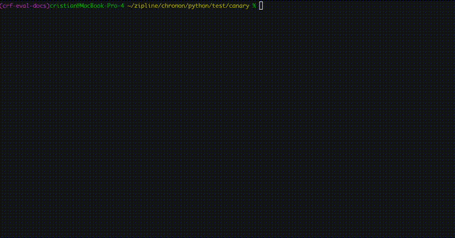

# Testing `GroupBy`s, `Join`s and `StagingQuery`s

This doc assumes that you have already a `GroupBy`, `Join`, or `StagingQuery` created that you wish to test.

## Compile

Compiling takes your python files, validates them for correctness, and produces serialized files that you can use in futures steps.

From the root of the main Chronon directory, run:

```bash
zipline compile
```

This will show you errors if there are any in your definitions, and show you changes.

Note, if you are making a change to any existing entities **without** changing the version it will prompt you with a warning.

## Eval

Before running expensive backfill jobs, use eval to quickly validate your configuration. Eval checks that:
- All source tables exist and are accessible
- Column names and types match your configuration
- Query syntax is valid (for StagingQueries)
- Derivations compile and type-check correctly
- Dependencies between configurations resolve correctly

### Quick Schema Validation

The most common use case - validate your configuration without running any computations:

```bash
zipline hub eval --conf compiled/joins/{team}/{your_conf}
```

This will show you the output schema, lineage, and catch configuration errors early. Example output:

```
🟢 Eval job finished successfully
Join Configuration: gcp.demo.user_features__1
  - Left table: data.user_activity_7d__0
  - Join parts: 2
  - Conf dependencies: 3
  - External tables: 2
  - Output Schema:
   [left]    user_id: string
   [left]    event_timestamp: long
   [left]    ds: string
   [joinPart: gcp.user_demographics__0]    user_id_age: integer
   [derivation]    is_adult: boolean

Lineage:
[Join] gcp.demo.user_features__1
├── ✅ [GroupBy] gcp.user_activity_7d__0
│   └── External: project.events.user_clicks
└── ✅ [GroupBy] gcp.user_demographics__0
    └── ✅ [StagingQuery] gcp.raw_demographics__0
```



### Testing with Sample Data

For deeper validation, provide sample data to see actual computation output:

```bash
# 1. Generate a test data skeleton
zipline hub eval --conf compiled/joins/{team}/{your_conf} --generate-skeleton

# 2. Fill in test-data.yaml with sample data (use !epoch for timestamps)

# 3. Run eval with test data
zipline hub eval --conf compiled/joins/{team}/{your_conf} --test-data-path test-data.yaml
```

This will show you the actual computed results with your sample data, helping you validate:
- Complex aggregations and window functions
- Derivation logic with concrete examples
- Join key matching behavior
- Null value handling

## Backfill

```sh
zipline hub backfill --conf compiled/{group_bys|staging_queries|joins}/{team}/{your_conf} --start-ds {YYYY-MM-dd} --end-ds {YYYY-MM-dd}
```

This will give you a URL to track the progress of your backfill.

You can also see your previously run jobs in the `home` page of the Zipline Hub UI.

Generally, it's suggested to run a small range of data first to perform validation, then proceed with the entire desired range.

Once the job is complete you can query your table to see the computed data (note the table name is in the overview section of the Zipline Hub UI for convenience).

If you wish to re-run a given range that is already marked as completed, then you'll also need to pass the `--force-recompute` flag. This can be used when you made a change that you wish to take effect, or when upstream data has changed and you wish to propogate the change to Chronon output.

## (Optional) Schedule

Running `schedule` from a branch will tell Zipline to run the regular jobs associated with your config.

**Note:** All configs on the `main` branch are automatically scheduled. You only need to run `schedule` manually from a branch if you want to schedule runs on a config **without** merging it to `main`.

This is helpful when you want to run an extended A/B test or experiment with the data pipeline. However, if you want to skip this step you can deploy the config to production simply by merging your PR.

```sh
zipline hub schedule --conf compiled/{group_bys|staging_queries|joins}/{team}/{your_conf}
```

This will run:
1. Frontfill jobs into the output table (if the `offline_schedule` argument is set on your entity)
2. Batch upload jobs for serving (if `online=True`)
3. Streaming jobs (if a topic is configured for the `GroupBy` being scheduled)

